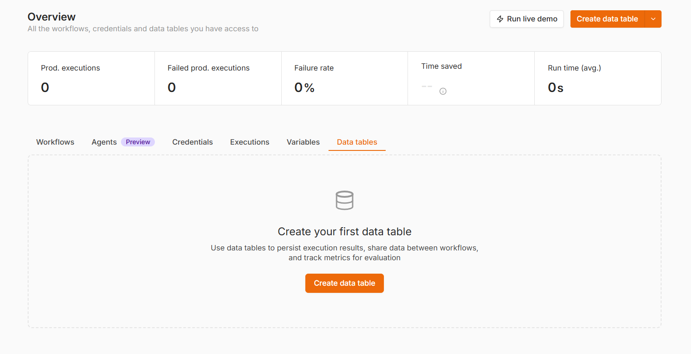
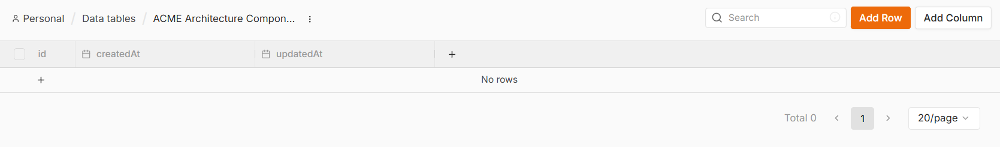
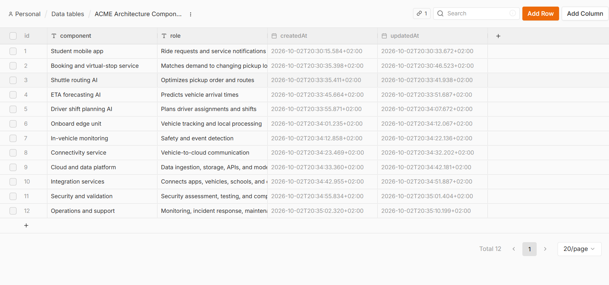
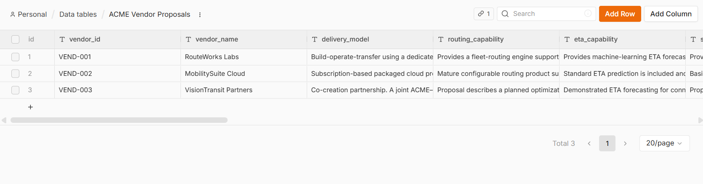
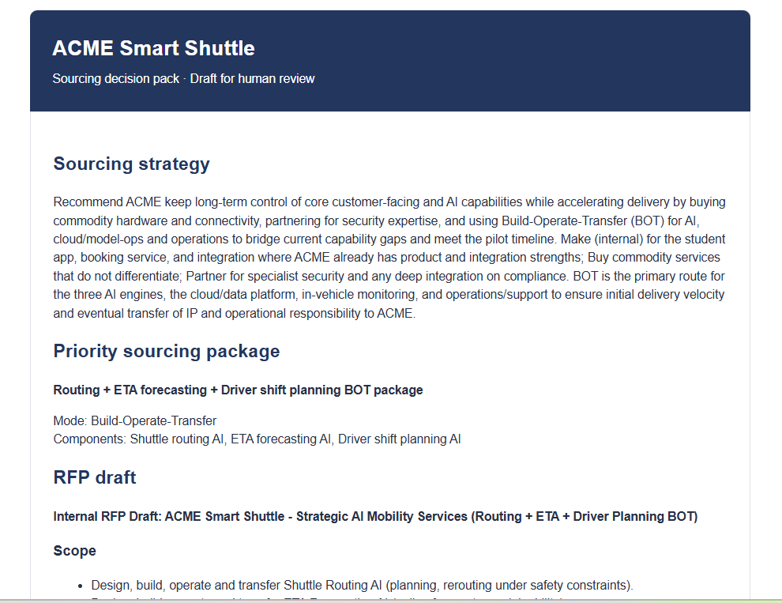
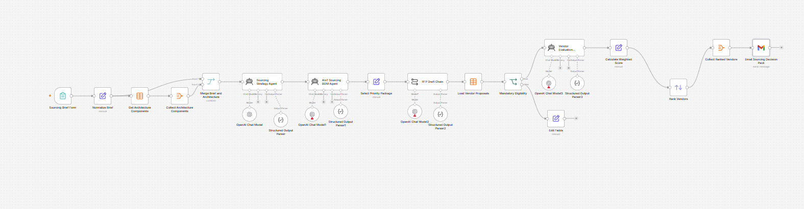
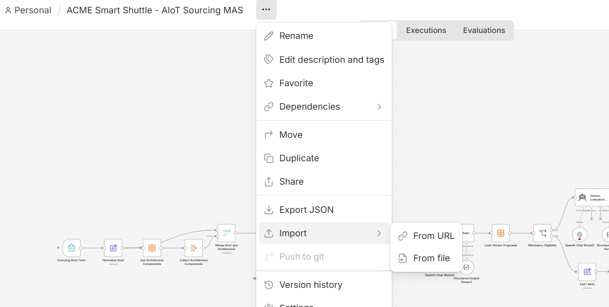

# ACME Smart Shuttle: n8n AIoT sourcing workflow

The plan follows the [Digital Playbook&#39;s AIoT sourcing process](https://www.digitalplaybook.org/index.php?title=Sourcing_and_Procurement) and its fictional ACME Smart Shuttle example.

## Use-case summary

ACME Smart Shuttle is a fictional on-demand school shuttle service. Students request rides through a mobile app, a booking service assigns virtual pickup stops, and AI capabilities optimize routes, forecast arrival times, and plan driver shifts. Vehicle edge devices, connectivity, cloud services, integration, security, and operations complete the AIoT architecture.

ACME considers routing, ETA forecasting, and driver shift planning strategically important and wants long-term control of them. However, it does not currently have enough AI staffing and model-operations capability to deliver them alone within the pilot timeline. The Digital Playbook therefore uses a **Build-Operate-Transfer** approach for these three capabilities: a supplier initially builds and operates them, while knowledge, assets, and operating responsibility are transferred to ACME over time.

In this classroom exercise, students turn a business sourcing brief into:

- component-level Make, Buy, Partner, or Build-Operate-Transfer decisions;
- an AIoT sourcing bill of materials;
- an internal RFP draft for the three priority AI capabilities;
- eligibility checks and structured evaluations of three fictional suppliers;
- deterministic weighted scores and a vendor ranking; and
- a formatted decision-pack email for human review.

The workflow supports decision preparation; it does not approve a supplier, issue an RFP, create a contract, or contact vendors.

## Workflow overview

The solution uses **one n8n workflow** and four AI-supported specialist stages:

1. `Sourcing Strategy Agent` recommends a sourcing mode for every architecture component.
2. `AIoT Sourcing BOM Chain` converts the strategy into a sourcing BOM and identifies the priority package.
3. `RFP Draft Chain` creates an internal RFP draft.
4. `Vendor Evaluation Agent` assesses each eligible fictional proposal against the RFP.

The BOM and RFP stages use Basic LLM Chains because they perform one bounded transformation. Eligibility, arithmetic scoring, sorting, aggregation, and email delivery use normal n8n nodes so that these steps are predictable and auditable. The final human reviewer remains responsible for the decision.

> **Terminology note:** An LLM chain follows a fixed prompt-to-output path. An AI Agent can select and call connected tools. The stable classroom version does not require tool calls because the tested Think and Calculator tools repeatedly reached the maximum-iteration limit. An optional agent-tool experiment is included at the end and should be kept outside the assessed workflow until tested.

### Final canvas

```text
Sourcing Brief Form → Normalize Brief → Get Architecture Components
                                      → Collect Architecture Components
                                      → Merge Brief and Architecture
                                      → Sourcing Strategy Agent
                                      → AIoT Sourcing BOM Chain
                                      → Select Priority Package
                                      → RFP Draft Chain
                                      → Load Vendor Proposals
                                      → Mandatory Eligibility (IF)
                                           false → Record Ineligible Proposal
                                           true  → Vendor Evaluation Agent
                                                 → Calculate Weighted Score
                                                 → Rank Vendors
                                                 → Collect Ranked Vendors
                                                 → Send Decision Pack (Gmail)
```

Later prompts use **named-node references** to read previous results. Therefore, the exact node names in this guide matter. You do not need `Prepare BOM Context` or `Prepare RFP Context` Merge nodes.

## 1. Getting started with n8n

### 1.1 Create a trial account

1. Open [n8n Cloud](https://app.n8n.cloud/register).
2. Create an account using your email address or an available sign-in provider.
3. Follow the prompts to create an n8n Cloud workspace and start the available **14-day free trial**. Trial availability and limits may change; check the current information shown during registration.
4. Open the workspace after registration.

No local installation is required for this guide.

### 1.2 Create and rename the workflow

1. From the n8n workspace, choose **Create Workflow** or **Start from scratch**.
2. Click the workflow-title box at the top of the canvas.
3. Enter `ACME Smart Shuttle - AIoT Sourcing` and confirm the name.
4. Save the workflow.

To rename any node, open the node and click its title box, enter the exact name from this guide, and confirm it. Exact names matter because later expressions refer to earlier nodes by name.

### 1.3 Connect a chat model

Use a model credential supplied by the instructor or your own supported API credential. If n8n Gateway credits are depleted, replace each Gateway/Qwen model sub-node with an **OpenAI Chat Model** or another available model and select your own API credential. An OpenAI API account needs its own API billing; a ChatGPT subscription does not include API usage.

For each model:

1. Add or open its Chat Model sub-node.
2. Select or create the appropriate credential.
3. Select an available model.
4. Set temperature to approximately `0.1` where available.
5. Use a sufficient output-token limit for structured JSON.

Use only fictional data and a reviewer email controlled by the student or instructor. Execute every AI node individually, inspect its output, and only then add the next node. In expression previews, `undefined` means the field or node path is wrong.

## 2. Create the architecture Data Table





In the project **Overview**, open **Data Tables** and create `ACME Architecture Components`. Add two **String/Text** columns named exactly `component` and `role`. Add these 12 rows:

| component                        | role                                                             |
| -------------------------------- | ---------------------------------------------------------------- |
| Student mobile app               | Ride requests and service notifications                          |
| Booking and virtual-stop service | Matches demand to changing pickup locations                      |
| Shuttle routing AI               | Optimizes pickup order and routes                                |
| ETA forecasting AI               | Predicts vehicle arrival times                                   |
| Driver shift planning AI         | Plans driver assignments and shifts                              |
| Onboard edge unit                | Vehicle tracking and local processing                            |
| In-vehicle monitoring            | Safety and event detection                                       |
| Connectivity service             | Vehicle-to-cloud communication                                   |
| Cloud and data platform          | Data ingestion, storage, APIs, and model operation               |
| Integration services             | Connects apps, vehicles, schools, and operations                 |
| Security and validation          | Security assessment, testing, and compliance evidence            |
| Operations and support           | Monitoring, incident response, maintenance, and model retraining |



## 3. Create the vendor Data Table

Create `ACME Vendor Proposals`. Use **Number** for `pilot_months` and `production_months`; use **String/Text** for every other column. The columns are:

```text
vendor_id
vendor_name
delivery_model
routing_capability
eta_capability
shift_planning_capability
integration_approach
security_evidence
model_operations
knowledge_transfer
pilot_months
production_months
price_summary
customer_references
risks_and_exclusions
```

Enter the following three rows. The wording intentionally creates different strengths and weaknesses. Treat all claims as fictional supplier claims, not verified facts.

### Row 1 — RouteWorks Labs

| Column                        | Value to enter                                                                                                                                                        |
| ----------------------------- | --------------------------------------------------------------------------------------------------------------------------------------------------------------------- |
| `vendor_id`                 | `VEND-001`                                                                                                                                                          |
| `vendor_name`               | `RouteWorks Labs`                                                                                                                                                   |
| `delivery_model`            | Dedicated team under a Build-Operate-Transfer model. Supplier builds and runs the three AI capabilities initially, then carries out a staged handover to ACME.        |
| `routing_capability`        | Describes dynamic routing using ride requests, virtual stops, vehicle capacity, and route constraints. Includes fictional results from a 60-vehicle mobility project. |
| `eta_capability`            | Describes ETA forecasts using vehicle location and trip history. Includes proposed validation metrics and confidence monitoring.                                      |
| `shift_planning_capability` | Offers configurable driver planning using availability, qualifications, and working-time constraints. Workforce-system integration needs clarification.               |
| `integration_approach`      | Proposes documented APIs for bookings, locations, route updates, ETA results, and driver schedules, plus a test environment.                                          |
| `security_evidence`         | Claims encryption, access control, audit logging, regular security testing, and an incident process. Supporting documents must be checked.                            |
| `model_operations`          | Proposes monitoring, drift checks, retraining triggers, versioning, rollback, and production support.                                                                 |
| `knowledge_transfer`        | Proposes an 18-month staged transfer of documentation, code and model assets subject to contract, operating procedures, training, and selected team knowledge.        |
| `pilot_months`              | `9`                                                                                                                                                                 |
| `production_months`         | `15`                                                                                                                                                                |
| `price_summary`             | Fictional estimate: EUR 780,000 pilot; EUR 1,250,000 first production year. Highest-priced proposal.                                                                  |
| `customer_references`       | Two fictional mobility references; reference calls offered.                                                                                                           |
| `risks_and_exclusions`      | High cost. ACME must provide usable data. Transfer of supplier employees requires separate agreement.                                                                 |

### Row 2 — MobilitySuite Cloud

| Column                        | Value to enter                                                                                                                                   |
| ----------------------------- | ------------------------------------------------------------------------------------------------------------------------------------------------ |
| `vendor_id`                 | `VEND-002`                                                                                                                                     |
| `vendor_name`               | `MobilitySuite Cloud`                                                                                                                          |
| `delivery_model`            | Subscription product with implementation services. Supplier retains operation of the core platform; no full transfer is offered.                 |
| `routing_capability`        | Packaged routing supports capacity, pickup windows, virtual stops, and route recalculation. Custom rules are limited to product configuration.   |
| `eta_capability`            | Standard ETA service uses vehicle location, traffic inputs, and trip history. Model internals remain proprietary.                                |
| `shift_planning_capability` | Basic driver assignment and schedule import. Complex optimization requires an extra module or integration.                                       |
| `integration_approach`      | Documented APIs and webhooks; core platform cannot be modified by ACME.                                                                          |
| `security_evidence`         | Claims encryption, access control, backup, vulnerability testing, and audit logs. Detailed reports require due diligence.                        |
| `model_operations`          | Supplier manages monitoring, updates, retraining, and incidents; ACME receives service reports with limited model-level visibility.              |
| `knowledge_transfer`        | Administrator training, API and configuration documentation, and handover workshops. No source code, model assets, or engineering-team transfer. |
| `pilot_months`              | `6`                                                                                                                                            |
| `production_months`         | `12`                                                                                                                                           |
| `price_summary`             | Fictional estimate: EUR 390,000 implementation and pilot; EUR 540,000 annual subscription plus scale-related charges.                            |
| `customer_references`       | Three fictional transport and shuttle references.                                                                                                |
| `risks_and_exclusions`      | Proprietary lock-in, limited knowledge transfer, weak shift-planning customization, and potentially costly migration.                            |

### Row 3 — VisionTransit Partners

| Column                        | Value to enter                                                                                                                                    |
| ----------------------------- | ------------------------------------------------------------------------------------------------------------------------------------------------- |
| `vendor_id`                 | `VEND-003`                                                                                                                                      |
| `vendor_name`               | `VisionTransit Partners`                                                                                                                        |
| `delivery_model`            | Co-creation partnership with a joint ACME–supplier team. Ownership terms are still to be agreed.                                                 |
| `routing_capability`        | Describes a planned routing engine but provides no completed routing deployment or measured results; a routing subcontractor is not yet selected. |
| `eta_capability`            | Demonstrates ETA forecasting in a fictional connected-fleet logistics setting, but not in school transportation.                                  |
| `shift_planning_capability` | Proposes custom driver planning developed jointly with ACME; not yet production-ready.                                                            |
| `integration_approach`      | Strong proposed edge-to-cloud integration, APIs, event exchange, and vehicle-system experience.                                                   |
| `security_evidence`         | Provides secure-development practices and planned testing; formal supporting evidence is incomplete.                                              |
| `model_operations`          | Proposes shared monitoring and retraining responsibilities; detailed thresholds and support commitments are not defined.                          |
| `knowledge_transfer`        | Joint delivery, shared documentation, paired work, and architecture reviews; final ownership terms need agreement.                                |
| `pilot_months`              | `11`                                                                                                                                            |
| `production_months`         | `18`                                                                                                                                            |
| `price_summary`             | Fictional estimate: EUR 610,000 for discovery and pilot; production pricing depends on scope and ownership terms.                                 |
| `customer_references`       | Fictional fleet integration and in-vehicle vision references; no comparable routing reference.                                                    |
| `risks_and_exclusions`      | Misses the nine-month pilot deadline; routing evidence, subcontractor, production price, and ownership are unresolved.                            |

Confirm that the table contains **three rows**, with numeric month values.



## 4. Build the intake form

Add **n8n Form Trigger**, rename it `Sourcing Brief Form`, and set the title to `ACME Smart Shuttle Sourcing Brief`. Add the following required elements. If n8n offers a **Field Name** as well as a label, use the machine-friendly field names shown here; it simplifies mapping.

| Label                        | Field name                       | Type                        |
| ---------------------------- | -------------------------------- | --------------------------- |
| Project name                 | `project_name`                 | Text                        |
| Business objective           | `business_objective`           | Textarea                    |
| Strategic differentiators    | `strategic_differentiators`    | Textarea                    |
| Internal strengths           | `internal_strengths`           | Textarea                    |
| Internal capability gaps     | `internal_capability_gaps`     | Textarea                    |
| Required launch horizon      | `required_launch_horizon`      | Text                        |
| Need for control             | `need_for_control`             | Dropdown: Low, Medium, High |
| Budget approach              | `budget_approach`              | Textarea                    |
| Deployment scope             | `deployment_scope`             | Textarea                    |
| Regulatory and risk concerns | `regulatory_and_risk_concerns` | Textarea                    |
| Reviewer email               | `reviewer_email`               | Email                       |

Use **Execute Workflow** and the form's **Test URL** while building. The production URL works only after publishing the workflow.

### Sample submission

| Field                        | Test value                                                                                                                                                                                                  |
| ---------------------------- | ----------------------------------------------------------------------------------------------------------------------------------------------------------------------------------------------------------- |
| Project name                 | ACME Smart Shuttle                                                                                                                                                                                          |
| Business objective           | Provide safe, flexible, on-demand shuttle transportation for schools using virtual stops, live vehicle data, and optimized routing.                                                                         |
| Strategic differentiators    | Reliable route optimization, accurate arrival-time forecasts, responsive demand planning, student safety, and a convenient user experience.                                                                 |
| Internal strengths           | Product management, customer relationships with schools, knowledge of school transportation operations, service design, and platform integration.                                                           |
| Internal capability gaps     | Limited experience recruiting and managing AI specialists, insufficient model-operations capability, limited computer-vision expertise, and no internal team experienced in large-scale fleet optimization. |
| Required launch horizon      | Pilot with 25 shuttles within 9 months; controlled production rollout for up to 250 shuttles within 15 months.                                                                                              |
| Need for control             | High                                                                                                                                                                                                        |
| Budget approach              | Stage-gated budget; compare fixed deliverables, subscription services, dedicated teams, and Build-Operate-Transfer. Final amounts require management approval.                                              |
| Deployment scope             | Begin with a 25-shuttle pilot and scale to as many as 250 shuttles across multiple locations if successful.                                                                                                 |
| Regulatory and risk concerns | Student safety, student and location data protection, cybersecurity, service continuity, model performance, explainability, supplier lock-in, and IP ownership.                                             |
| Reviewer email               | Your own or instructor-controlled email address                                                                                                                                                             |

## 5. Normalize the brief

Add **Edit Fields (Set)** after the trigger, rename it `Normalize Brief`, and select **Manual Mapping**. Create the eleven internal fields listed above. If the Form Trigger already emits those exact field names, drag each field from the input panel into the matching field. If it emits labels, drag the corresponding label into each internal field. Keep only the mapped fields. Add two fixed text fields:

- `use_case_name`: `ACME Smart Shuttle`
- `decision_status`: `Draft for internal review`

Execute. Confirm it outputs **one item** with the thirteen fields and no blanks.

## 6. Read and collect architecture components

1. Add **Data Table** after `Normalize Brief`; rename it `Get Architecture Components`.
2. Choose **Resource: Row**, **Operation: Get**, and the `ACME Architecture Components` table. Turn on **Return All** or use a limit greater than 12.
3. Execute. Expect **12 items**.
4. Add **Aggregate**; rename it `Collect Architecture Components`.
5. Choose **All Item Data**; **Put Output in Field:** `architecture_components`; **Include:** `Specified Fields`; **Fields to Include:** `component, role`.
6. Execute. Expect **one item** containing a list of 12 component-and-role objects.

## 7. Merge the brief and architecture

1. Add **Merge**, rename it `Merge Brief and Architecture`.
2. Connect `Normalize Brief` directly to Input 1.
3. Connect `Collect Architecture Components` to Input 2.
4. Choose **Combine**, then **By Position**.
5. Execute. Expect **one item** containing the brief fields and `architecture_components`.

Do not continue if the merge yields 12 items or omits either input.

## 8. Sourcing Strategy Agent

Add **AI Agent** after `Merge Brief and Architecture`; rename it `Sourcing Strategy Agent`. Attach the approved Chat Model. Set its prompt source to **Define below** and enable **Require Specific Output Format**. Attach a **Structured Output Parser**. Use temperature approximately 0.1. Keep the strategy schema small because the earlier eight-fields-per-component schema frequently produced truncated or invalid structured output.

The tested classroom setup already ran this node with a Chat Model and parser. If a fresh n8n editor insists on a Tool connection for the AI Agent, use a **Basic LLM Chain** named `Sourcing Strategy Agent` with the same messages and parser instead. The downstream node-name references in this guide still work. This changes the technical type of this specialist, but not its structured output or the sourcing process.

### System Message

Paste:

```text
You are ACME Smart Shuttle's AIoT sourcing-strategy specialist.

Use only the sourcing brief and architecture-component list in the user message. Evaluate every listed component separately. Return exactly one decision per component, using its name exactly as supplied.

Choose one mode per component: Make, Buy, Partner, or Build-Operate-Transfer. Make means ACME primarily develops and operates it. Buy means obtaining a standard product or service. Partner means jointly developing or operating it. Build-Operate-Transfer means a supplier initially builds and operates it and later transfers agreed knowledge, assets, and responsibility to ACME.

Consider differentiation, ACME's stated strengths and gaps, delivery time, desired control, long-term operation, and dependencies. Routing AI, ETA forecasting AI, and driver shift planning AI are strategically important; ACME wants long-term control but lacks enough AI capability now. Build-Operate-Transfer is a strong candidate for these three.

Keep every component aligned with its supplied role. The Onboard edge unit is for tracking and local processing; in-vehicle monitoring is for safety and event detection.

Do not introduce named laws, certifications, products, suppliers, market facts, or jurisdiction-specific requirements unless supplied. Phrase unknowns as questions requiring confirmation rather than facts.

Return only strategy_summary, component_decisions, strategy_assumptions, and management_questions. Each component decision needs component_name, strategic_importance, recommended_mode, and a rationale of at most two sentences. Follow the Structured Output Parser exactly.
```

### User Message

Paste:

```text
Create a component-level sourcing strategy for ACME Smart Shuttle.

SOURCING BRIEF
{{ JSON.stringify($('Normalize Brief').first().json, null, 2) }}

ARCHITECTURE COMPONENTS
{{ JSON.stringify($json.architecture_components, null, 2) }}

Return one decision for each of the 12 supplied components.
```

### Structured Output Parser example

Choose **Generate from JSON Example** and paste:

```json
{
  "strategy_summary": "A concise summary of the component-level sourcing approach.",
  "component_decisions": [
    {
      "component_name": "Shuttle routing AI",
      "strategic_importance": "High",
      "recommended_mode": "Build-Operate-Transfer",
      "rationale": "Routing is differentiating, but ACME lacks sufficient AI capability for the pilot timeline."
    }
  ],
  "strategy_assumptions": [
    "Supplier availability for Build-Operate-Transfer requires confirmation."
  ],
  "management_questions": [
    "Which assets and responsibilities must eventually transfer to ACME?"
  ]
}
```

Execute. Confirm **one output item** and **12 component decisions**, including Build-Operate-Transfer for routing, ETA, and driver shift planning. In the tested setup the parsed result appears under `output`, for example `output.component_decisions`. If your n8n output differs, adjust later named-node paths to the actual shape.

### If the model rejects the parser

The previous larger parser produced `Model output doesn't fit required format`. Do not switch on **Continue on Error**. Confirm the simplified example above, reduce verbose prompt content, and retry once. If it still fails, use a **Basic LLM Chain + Structured Output Parser** with the same name and messages. Use its parsed `output` in all later references.

## 9. AIoT Sourcing BOM specialist

Use a **Basic LLM Chain** here; rename it `AIoT Sourcing BOM Chain`. Connect it after `Sourcing Strategy Agent`. Attach the approved Chat Model and a **Structured Output Parser**. Select **Define below** for the prompt. Do not attach a Think Tool; the tested tool-using version repeatedly called the tool and reached the ten-iteration limit.

### System Message, if the chain exposes one

Paste the following into the chain's System Message. If it offers only one prompt field, put this text above the User Message below.

```text
You are ACME Smart Shuttle's AIoT Sourcing BOM specialist. Create a representative sourcing BOM using only the supplied brief, architecture, and sourcing decisions.

Produce exactly one BOM item for each of the 12 architecture components, with its exact supplied name and unchanged sourcing mode. For each item give its purpose, pilot sizing, scale sizing, main dependency, and acceptance evidence. Use the 25-shuttle pilot and potential 250-shuttle scale-up. Describe software and service sizing without inventing exact staffing, usage, cost, or dates.

Identify key dependencies and open questions for the nine-month pilot and 15-month rollout. Group routing AI, ETA forecasting AI, and driver shift planning AI into one recommended Build-Operate-Transfer sourcing package.

Keep every field concise. Return only the fields required by the Structured Output Parser.
```

### User Message

```text
Create the representative AIoT Sourcing BOM for ACME Smart Shuttle.

SOURCING BRIEF
{{ JSON.stringify($('Normalize Brief').first().json, null, 2) }}

ARCHITECTURE COMPONENTS
{{ JSON.stringify($('Collect Architecture Components').first().json.architecture_components, null, 2) }}

SOURCING STRATEGY
{{ JSON.stringify($('Sourcing Strategy Agent').first().json.output, null, 2) }}

Create exactly 12 BOM items. Preserve each strategy mode. Keep pilot and scale sizing separate. List the main dependencies and unresolved questions.
```

### Structured Output Parser example

```json
{
  "bom_summary": "Representative sourcing BOM for the 25-shuttle pilot and possible 250-shuttle rollout.",
  "bom_items": [
    {
      "component_name": "Shuttle routing AI",
      "purpose": "Optimize pickup order and routes.",
      "sourcing_mode": "Build-Operate-Transfer",
      "pilot_sizing": "Routing capability for 25 shuttles.",
      "scale_sizing": "Capacity for up to 250 shuttles; transaction volume to be confirmed.",
      "main_dependency": "Booking and virtual-stop requests and vehicle-location data.",
      "acceptance_evidence": "Demonstrated routing results, documented interface, and transfer plan."
    }
  ],
  "critical_dependencies": [
    "Routing and ETA need booking and vehicle-location data."
  ],
  "open_questions": [
    "What service capacity and support staffing are needed for the pilot?"
  ],
  "priority_package": {
    "package_name": "Strategic AI Mobility Services",
    "included_components": [
      "Shuttle routing AI",
      "ETA forecasting AI",
      "Driver shift planning AI"
    ],
    "sourcing_mode": "Build-Operate-Transfer"
  }
}
```

Execute. Expect one item, 12 BOM items, separate pilot and scale sizing, and the three AI components in `priority_package`. As with the Strategy Agent, inspect whether the chain stores its parsed result under `output`.

## 10. Select the RFP package

Add **Edit Fields (Set)** after the BOM Chain; rename it `Select Priority Package`. Keep input fields in the output. In **Manual Mapping**, add:

| Field                       | Fixed text                                                                                                 |
| --------------------------- | ---------------------------------------------------------------------------------------------------------- |
| `package_name`            | Strategic AI Mobility Services                                                                             |
| `included_capabilities`   | Shuttle routing AI; ETA forecasting AI; Driver shift planning AI                                           |
| `preferred_sourcing_mode` | Build-Operate-Transfer                                                                                     |
| `pilot_deadline`          | Nine months from project start                                                                             |
| `production_deadline`     | Fifteen months from project start                                                                          |
| `package_reason`          | Strategic AI capabilities require long-term ACME control, while ACME lacks immediate AI staffing capacity. |

Execute and confirm one item with these six fields. Do not add `Prepare RFP Context`; the next prompt reads earlier nodes by name.

## 11. RFP draft specialist

Add **Basic LLM Chain** after `Select Priority Package`; rename it `RFP Draft Chain`. Attach the approved Chat Model and a Structured Output Parser. Do not require Think or Calculator tool calls for a fixed seven-number weight check. The weights are stated in the prompt and validated manually once during setup.

### System Message, if available

```text
You draft an internal RFP for ACME Smart Shuttle's Strategic AI Mobility Services package. Use only the supplied brief, strategy, BOM, and package definition. Do not invent approved legal terms, supplier facts, budget ceilings, certifications, or SLA numbers.

Cover routing, ETA forecasting, driver shift planning, integration, security and privacy approach, model monitoring and retraining, delivery milestones, knowledge transfer, supplier evidence, commercial response, and open questions.

Mark proposed SLA targets for human confirmation. This is an internal draft, not an issued RFP. Follow the Structured Output Parser exactly and keep every field concise.
```

### User Message

```text
Create the internal RFP draft for the ACME Smart Shuttle priority package.

BRIEF
{{ JSON.stringify($('Normalize Brief').first().json, null, 2) }}

STRATEGY
{{ JSON.stringify($('Sourcing Strategy Agent').first().json.output, null, 2) }}

SOURCING BOM
{{ JSON.stringify($('AIoT Sourcing BOM Chain').first().json.output, null, 2) }}

SELECTED PACKAGE
Package: {{ $json.package_name }}
Capabilities: {{ $json.included_capabilities }}
Mode: {{ $json.preferred_sourcing_mode }}
Pilot: {{ $json.pilot_deadline }}
Production: {{ $json.production_deadline }}

Use exactly these criterion weights: functional and AI capability 25; integration 15; delivery 15; model operations and SLAs 15; security and privacy 10; knowledge transfer and lock-in 10; commercial fit 10. Their total is 100.

Mandatory conditions: pilot within nine months; all three capabilities addressed; documented interfaces; security and privacy approach; model monitoring and retraining approach; knowledge-transfer and exit plan; evidence and references.
```

### Structured Output Parser example

```json
{
  "rfp_title": "ACME Smart Shuttle — Strategic AI Mobility Services",
  "status": "Internal draft for human review",
  "project_overview": "On-demand school shuttle service with virtual stops, vehicle data, and optimized planning.",
  "scope_of_work": ["Develop routing, ETA, and driver planning and prepare transfer to ACME."],
  "functional_requirements": ["Describe and demonstrate dynamic routing for the pilot."],
  "nonfunctional_requirements": ["Propose measurable availability, security, privacy, and recovery commitments for ACME review."],
  "integration_requirements": ["Document booking, vehicle-location, route, ETA, and schedule interfaces."],
  "model_operations_requirements": ["Describe monitoring, drift review, retraining, versioning, and rollback."],
  "knowledge_transfer_requirements": ["Specify documentation, assets, training, operating procedures, and exit support."],
  "delivery_milestones": ["Pilot readiness within nine months; production readiness within fifteen months."],
  "mandatory_conditions": ["Credible pilot plan within nine months; all three capabilities; interfaces; security and privacy; model operations; transfer plan; evidence and references."],
  "evaluation_weights": {
    "functional_ai": 25,
    "integration": 15,
    "delivery": 15,
    "model_operations": 15,
    "security_privacy": 10,
    "knowledge_transfer": 10,
    "commercial": 10
  },
  "commercial_response_requested": ["Pilot, production, recurring operations, scale, and exit costs."],
  "supplier_questions": ["Which model assets and operating materials can transfer to ACME?"],
  "internal_approval_questions": ["Which SLA targets should ACME approve before issuing an RFP?"]
}
```

Execute. Confirm one item, `status` says internal draft, and the seven weights add to 100. If the model invents a target, edit the prompt or review the draft before using it downstream.

## 12. Load proposals

Add **Data Table** after `RFP Draft Chain`; rename it `Load Vendor Proposals`. Choose **Row → Get**, select `ACME Vendor Proposals`, and return all rows. Execute. Expect **three items**. If your instance instead returns one list, add **Split Out** to create one item per vendor.

## 13. Mandatory eligibility

Add **IF** after `Load Vendor Proposals`; rename it `Mandatory Eligibility`. Use **AND / All** for these conditions:

| Field                         | Test                                 |
| ----------------------------- | ------------------------------------ |
| `pilot_months`              | number is less than or equal to`9` |
| `routing_capability`        | is not empty                         |
| `eta_capability`            | is not empty                         |
| `shift_planning_capability` | is not empty                         |
| `integration_approach`      | is not empty                         |
| `security_evidence`         | is not empty                         |
| `model_operations`          | is not empty                         |
| `knowledge_transfer`        | is not empty                         |
| `customer_references`       | is not empty                         |

This is a **basic presence and timing gate**, not an evidence-quality judgment. RouteWorks and MobilitySuite should go to **true**. VisionTransit should go to **false**, mainly because its pilot takes 11 months.

On the false branch, add **Edit Fields (Set)** named `Record Ineligible Proposal`; keep input fields and add `eligibility_status = Ineligible` and `eligibility_reason = Pilot deadline or required proposal field failed the mandatory gate`. The vendor's original fields remain available for review. The core classroom flow does not need to merge this branch back into the ranking.

## 14. Vendor Evaluation Agent

Connect the **true** branch of `Mandatory Eligibility` to an **AI Agent** named `Vendor Evaluation Agent`. Attach the approved Chat Model and a **Structured Output Parser**. Set temperature near `0.1`.

Do **not** connect Calculator or Think tools in the stable classroom workflow. During testing, repeated tool calls caused `Max iterations (10) reached`. The model produces the qualitative assessment and 1–5 criterion scores; the next normal n8n node performs the authoritative arithmetic.

If your n8n version requires an AI Agent to have a tool, use a **Basic LLM Chain** named `Vendor Evaluation Agent` with the same prompt and parser. The remaining expressions still work because the node name and output structure stay the same.

### System Message

```text
You evaluate one fictional vendor proposal at a time for ACME Smart Shuttle. Use only the current proposal and the internal RFP supplied in the user message. Treat vendor claims as unverified claims. State missing evidence and material risks. Do not infer capabilities from a company name.

Score each of seven criteria from 1 to 5: 1 means no usable evidence or major failure; 2 means major gaps; 3 means acceptable with material questions; 4 means strong with minor gaps; 5 means specific and well supported.

Criteria and weights are: functional AI 25, integration 15, delivery 15, model operations 15, security/privacy 10, knowledge transfer 10, commercial fit 10.

Provide seven named numeric score fields and short reasons, plus risks and questions. Do not calculate the weighted total. The workflow will calculate it independently. Follow the Structured Output Parser exactly.
```

### User Message

```text
Evaluate this one eligible vendor proposal.

VENDOR
{{ JSON.stringify($json, null, 2) }}

RFP
{{ JSON.stringify($('RFP Draft Chain').first().json.output, null, 2) }}

Preferred sourcing mode: Build-Operate-Transfer. Pilot deadline: nine months. Score all seven criteria from 1 to 5. Keep reasons concise. Identify knowledge-transfer and lock-in concerns.
```

### Structured Output Parser example

```json
{
  "vendor_id": "VEND-001",
  "vendor_name": "RouteWorks Labs",
  "functional_ai_score": 4,
  "integration_score": 4,
  "delivery_score": 4,
  "model_operations_score": 4,
  "security_privacy_score": 3,
  "knowledge_transfer_score": 5,
  "commercial_score": 3,
  "score_reasons": ["Functional AI: strong routing and ETA claims, with shift-planning integration to clarify."],
  "strengths": ["Detailed transfer proposal."],
  "risks": ["High cost and dependence on data quality."],
  "clarification_questions": ["Which code, model assets, and operating materials transfer to ACME?"],
  "recommended_next_step": "Invite to presentation"
}
```

Execute the node. Expect **two items**, one per eligible vendor. Check that each item identifies the correct vendor and contains seven numeric scores between 1 and 5. If the model still reaches the iteration limit, replace this node with a Basic LLM Chain using the same name, messages, and parser.

## 15. Calculate the authoritative score

Add **Edit Fields (Set)** after `Vendor Evaluation Agent`; rename it `Calculate Weighted Score`. Keep all incoming fields. Add a **Number** field named `weighted_total`, change its value to **Expression**, and paste this n8n expression. It is a field mapping, not a Code node:

```text
{{ Math.round((
  Number($json.output.functional_ai_score) * 25 +
  Number($json.output.integration_score) * 15 +
  Number($json.output.delivery_score) * 15 +
  Number($json.output.model_operations_score) * 15 +
  Number($json.output.security_privacy_score) * 10 +
  Number($json.output.knowledge_transfer_score) * 10 +
  Number($json.output.commercial_score) * 10
) / 5 * 10) / 10 }}
```

The formula produces a 0–100 score with one decimal. If the parsed fields are not nested under `output`, remove `.output` from every field path. Inspect the expression preview: it must show a number, not `NaN`.

Turn on **Include Other Input Fields**. This is essential: the ranked email needs the vendor name, reasons, risks, and recommendation as well as the score.

There is no `Compare Score Check` node in the final workflow. It is unnecessary because the model no longer calculates a provisional total.

## 16. Rank and collect vendors

1. Add **Sort** directly after `Calculate Weighted Score`; rename it `Rank Vendors`.
2. In the Sort node, add one sorting field. Enter the plain field name `weighted_total`; do not insert an expression that evaluates to a number. Choose **Descending**.
3. Execute the node. Its input must contain two separate items, each with a top-level `weighted_total` field. The higher score must appear first.
4. Add **Aggregate** after `Rank Vendors`; rename it `Collect Ranked Vendors`.
5. Choose **All Item Data**; set **Put Output in Field** to `ranked_vendors`; include all fields.
6. Execute. Expect one item containing a `ranked_vendors` list with two vendor objects, highest score first.

Keep VisionTransit outside this ranked list. Its ineligible record is available on the separate branch.

## 17. Send the consolidated decision pack for human review

Add a **Gmail** node directly after `Collect Ranked Vendors` and rename it `Send Decision Pack`. Choose **Message → Send** and connect an instructor-controlled or student-controlled Gmail credential.

Configure:

- **To:** drag `reviewer_email` from `Normalize Brief`, or use `{{ $('Normalize Brief').first().json.reviewer_email }}`.
- **Subject:** `ACME Smart Shuttle | Sourcing decision pack for review`
- **Email Type / Format:** `HTML`
- **Message:** paste the HTML below.

```html
<div style="font-family:Arial,sans-serif;max-width:760px;margin:auto;color:#243047;line-height:1.5">
  <div style="background:#17365d;color:white;padding:24px;border-radius:8px 8px 0 0">
    <h1 style="margin:0;font-size:22px">ACME Smart Shuttle</h1>
    <p style="margin:6px 0 0">Sourcing decision pack · Draft for human review</p>
  </div>

  <div style="border:1px solid #dce3eb;padding:24px">
    <h2 style="color:#17365d">Sourcing strategy</h2>
    <p>{{ $('Sourcing Strategy Agent').first().json.output.strategy_summary }}</p>

    <h2 style="color:#17365d">Priority sourcing package</h2>
    <p><strong>{{ $('AIoT Sourcing BOM Chain').first().json.output.priority_package.package_name }}</strong></p>
    <p>
      Mode: {{ $('AIoT Sourcing BOM Chain').first().json.output.priority_package.sourcing_mode }}<br>
      Components: {{ $('AIoT Sourcing BOM Chain').first().json.output.priority_package.included_components.join(', ') }}
    </p>

    <h2 style="color:#17365d">RFP draft</h2>
    <p><strong>{{ $('RFP Draft Chain').first().json.output.rfp_title }}</strong></p>

    <h3>Scope</h3>
    <ul>
      {{ $('RFP Draft Chain').first().json.output.scope_of_work.map(x => '<li>' + x + '</li>').join('') }}
    </ul>

    <h3>Open approvals</h3>
    <ul>
      {{ $('RFP Draft Chain').first().json.output.internal_approval_questions.map(x => '<li>' + x + '</li>').join('') }}
    </ul>

    <h2 style="color:#17365d">Ranked eligible vendors</h2>
    {{ $json.ranked_vendors.map((v, i) => '<div style="background:#f3f6fa;padding:14px;margin:10px 0;border-left:4px solid #3174b9"><strong>#' + (i + 1) + ' ' + v.output.vendor_name + '</strong><br>Weighted score: <strong>' + v.weighted_total + '</strong><br>Next step: ' + v.output.recommended_next_step + '</div>').join('') }}

    <p style="font-size:13px;color:#5b6472">
      <strong>Eligibility note:</strong> VisionTransit Partners was excluded because its 11-month proposed pilot exceeds the 9-month target.
    </p>

    <div style="background:#eaf2fb;padding:16px;margin-top:24px">
      <strong>Review requested</strong>
      <p style="margin-bottom:0">Please reply with your decision and comments. This draft does not authorize a supplier award, contract, or external supplier contact.</p>
    </div>
  </div>
</div>
```

Use the exact node names from this guide. If n8n reports that a node does not exist, do not type the reference manually: open the expression editor and drag the required value from the node picker. Invisible characters copied into node or field names can otherwise cause lookup failures.

Before sending, preview the message and confirm that it displays:

- the sourcing-strategy summary;
- the priority package without `[object Object]`;
- the RFP title, scope, and open approvals;
- two ranked vendors with names, calculated scores, and next steps; and
- the eligibility note and human-review disclaimer.

The Gmail node sends a review pack. The reviewer replies outside the workflow. This is an intentionally simple human-in-the-loop endpoint for the classroom demonstration.



## 18. Complete end-to-end test



Run from the Form Trigger's **Test URL** with the sample brief. Inspect these checkpoints in order:

1. `Normalize Brief`: one item, all fields present.
2. `Get Architecture Components`: 12 items.
3. `Collect Architecture Components`: one list of 12.
4. `Merge Brief and Architecture`: one item containing brief and list.
5. `Sourcing Strategy Agent`: 12 decisions; three strategic AI components assigned Build-Operate-Transfer.
6. `AIoT Sourcing BOM Chain`: 12 BOM items, pilot and scale sizing, priority AI package.
7. `RFP Draft Chain`: one internal draft; weights total 100.
8. `Load Vendor Proposals`: three items.
9. `Mandatory Eligibility`: two true, one false.
10. `Vendor Evaluation Agent`: two evaluations with seven numeric scores each.
11. `Calculate Weighted Score`: two 0–100 numbers, not `NaN`.
12. `Rank Vendors`: descending scores.
13. `Collect Ranked Vendors`: one list of two vendors.
14. `Send Decision Pack`: HTML email contains the strategy, package, RFP, two ranked vendors, and review disclaimer.

Do not publish until this end-to-end test succeeds. Save the workflow frequently while building.

## 19. Common fixes

| Symptom                                              | Fix                                                                                                   |
| ---------------------------------------------------- | ----------------------------------------------------------------------------------------------------- |
| `undefined` in a prompt preview                    | Inspect the named node's output. Confirm the exact field and whether it is nested under`output`.    |
| Item-linking error with`.item`                     | Use`.first()` for the one-item brief, architecture list, strategy, BOM, and RFP nodes.              |
| Strategy parser rejects output                       | Keep the four-field-per-component schema. Use a separate formatter chain if needed.                   |
| BOM specialist repeatedly calls Think Tool           | Use the BOM Basic LLM Chain in this guide and remove the Think Tool.                                  |
| BOM contains invented staff counts or dates          | Require a sizing basis and record unknowns as questions.                                              |
| RFP weights differ from 100                          | Use the fixed seven weights from this guide and rerun the RFP Chain.                                  |
| Vendor evaluator reaches Max Iterations              | Remove Calculator/Think tools; use the documented Basic LLM Chain fallback if necessary.              |
| Vendor ranking is`NaN`                             | Check whether scores are under`$json.output`, and confirm all seven are numeric.                    |
| Sort says field`58`, `61`, or similar is missing | Enter plain text`weighted_total` as the Sort field; do not use an expression returning the score.   |
| Sort cannot find`weighted_total`                   | Connect`Calculate Weighted Score` directly to `Rank Vendors` and keep other input fields enabled. |
| Priority package displays`[object Object]`         | Map its individual properties in the HTML or use`JSON.stringify(...)` for a plain-text email.       |
| Ranked-vendor section is blank                       | Gmail must follow`Collect Ranked Vendors`; map `$json.ranked_vendors` from that input.            |

## 20. Optional agent-tool or memory extension

Do not add this before the stable workflow has passed its end-to-end test.

- A connected tool demonstrates genuine agentic behavior only when the AI Agent autonomously chooses and calls it during its task.
- A normal Google Sheets node placed after an AI node demonstrates workflow automation and external action, but it is not an agent-selected tool call.
- Memory is most useful for a multi-turn chat. This workflow is a single execution with explicit context passed between nodes, so memory is not required and may mix data between vendor evaluations if configured incorrectly.

For a later experiment, duplicate the Vendor Evaluation Agent on a separate test branch and connect a read-only lookup or controlled write tool supported by your n8n version. Test with one fictional vendor and inspect the tool-call trace. Keep this experiment disconnected from scoring, ranking, and email until it reliably terminates.

### Optional: Import the reference workflow



You may also import the provided n8n workflow file into your workspace as a reference. This lets you open individual nodes, inspect their settings, prompts, expressions, mappings, and connections while following this guide. Use the imported workflow for learning and comparison; you must still configure your own credentials, Data Tables, email address, and model access before executing it.

## References

- [Digital Playbook: Sourcing and Procurement](https://www.digitalplaybook.org/index.php?title=Sourcing_and_Procurement)
- [n8n Cloud free trial](https://docs.n8n.io/manage-cloud/cloud-free-trial/)
- [Create an n8n workflow](https://docs.n8n.io/workflows/create/)
- [n8n OpenAI credentials](https://docs.n8n.io/integrations/builtin/credentials/openai/)
- [n8n Form Trigger](https://docs.n8n.io/integrations/builtin/core-nodes/n8n-nodes-base.formtrigger/)
- [n8n Form](https://docs.n8n.io/integrations/builtin/core-nodes/n8n-nodes-base.form/)
- [n8n Data Table](https://docs.n8n.io/integrations/builtin/core-nodes/n8n-nodes-base.datatable/)
- [n8n Aggregate](https://docs.n8n.io/integrations/builtin/core-nodes/n8n-nodes-base.aggregate/)
- [n8n AI Agent](https://docs.n8n.io/integrations/builtin/cluster-nodes/root-nodes/n8n-nodes-langchain.agent/)
- [n8n Structured Output Parser](https://docs.n8n.io/integrations/builtin/cluster-nodes/sub-nodes/n8n-nodes-langchain.outputparserstructured/)
- [n8n Gmail node](https://docs.n8n.io/integrations/builtin/app-nodes/n8n-nodes-base.gmail/)
